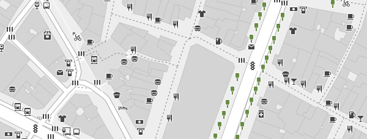

Röntgen project focuses on displaying every [OpenStreetMap](http://openstreetmap.org) data tag on the map.

Why do we need yet another map style?
-------------------------------------

It is actually not just another map style since it is **not** *a map for users* but *map for OpenStreetMap contributors*. Suppose, you spent time adding colors for building walls, benches and shelters for bus stops but they do not represented on the map. Röntgen helps to display all changes you made.

Map generation
--------------

**Requirements**: Python 2.7.

There are simple Python renderer that generates SVG map from OpenStreetMap data. You can run it using:

    python mapper.py -i <input OSM XML file name> -o <output SVG file name>

### Options ###

<table><tr><td>Option

</td><td>Value

</td><td>Description

</td></tr><tr><td><tt>-bbox</tt>, <tt>--boundary-box</tt>

</td><td><tt>&lt;longitude 1&gt;,&lt;longitude 2&gt;,&lt;latitude 1&gt;,&lt;latitude 2&gt;</tt> (decimal float)

</td><td>Boundary box to draw

</td></tr><tr><td><tt>-s</tt>, <tt>--size</tt>

</td><td><tt>&lt;width&gt;,&lt;height&gt;</tt> (pixels)

</td><td>Result image size

</td></tr></table>

Icon set
--------

If tag is drawable it is displayed using icon combination and colors.

All icons are under [CC BY 4.0](http://creativecommons.org/licenses/by/4.0/) license. So, do whatever you want but give appropriate credit.

Double size:

Feel free to request new icons via issues for whatever you want to see on the map. No matter how frequently the tag is used in OpenStreetMap since final goal is to cover all tags. However, common used tags have priority, other things being equal.

