<!--
    This is generated file.
    Do not edit it manually, edit the Moire source file instead.
-->

The **Map Machine** project consists of


  * a Python [OpenStreetMap](http://openstreetmap.org) renderer:
    * SVG [map generation](#map-generation),
    * SVG and PNG [tile generation](#tile-generation),
  * the [Röntgen](#röntgen-icon-set) icon set: unique CC-BY 4.0 map icons.

The idea behind the Map Machine project is to **show all the richness of the OpenStreetMap data**: to have a possibility to display any map feature represented by OpenStreetMap data tags by means of colors, shapes, and icons. Map Machine is created both for map contributors: to display all changes one made on the map even if they are small, and for map users: to dig down into the map and find every detail that was mapped.

Unlike standard OpenStreetMap layers, **Map Machine is a playground for experiments** where one can easily try to support any unsupported tag, proposed tagging scheme, tags with little or even single usage, deprecated ones that are still in use.

Map Machine is intended to be highly configurable, so it can generate precise but messy maps for OSM contributors as well as pretty and clean maps for OSM users. It can also use some slow algorithms for experimental features.

See

  * [installation instructions](#installation),
  * [map features](#map-features),
  * [using Röntgen as JOSM style](#use-röntgen-as-josm-map-paint-style).

Usage example
-------------

```shell
map-machine render -b 2.284,48.860,2.290,48.865
```

will automatically download OSM data and render an SVG map of the specified area to `out/map.svg`. See [Map generation](#map-generation).

```shell
map-machine tile -b 2.361,48.871,2.368,48.875
```

will automatically download OSM data and render PNG tiles that cover the specified area to the `out/tiles` directory. See [Tile generation](#tile-generation).

Röntgen icon set
----------------

The central feature of the project is the Röntgen icon set. It is a set of monochrome 14 × 14 px pixel-aligned icons specially created for the Map Machine project. Unlike the Map Machine source code, which is under the MIT license, all icons are under the [CC BY](http://creativecommons.org/licenses/by/4.0/) license. So, with the appropriate credit the icon set can be used outside the project. Some icons can be used as emoji symbols.

All icons tend to support a common design style, which is heavily inspired by [Maki](https://github.com/mapbox/maki), [Osmic](https://github.com/gmgeo/osmic), and [Temaki](https://github.com/ideditor/temaki).

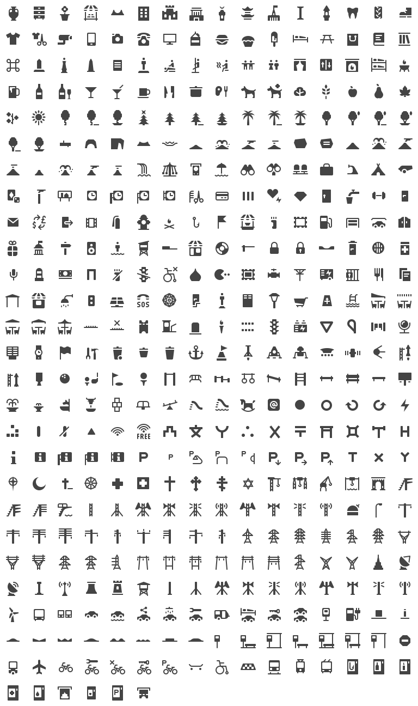

Feel free to request new icons via issues for whatever you want to see on the map. No matter how frequently the tag is used in OpenStreetMap since the final goal is to cover all tags. However, commonly used tags have priority, other things being equal.

Generate an icon grid and sets of individual icons with `map-machine icons`. It will update the `doc/grid.svg` file, and create SVG files in the `out/icons_by_id` directory where files are named using shape identifiers (e.g. `power_tower_portal_2_level.svg`) and in the `icons_by_name` directory where files are named using shape names (e.g. `Röntgen portal two-level transmission tower.svg`). Files from the last directory are used in the OpenStreetMap wiki (e.g. [`File:Röntgen_portal_two-level_transmission_tower.svg`](https://wiki.openstreetmap.org/wiki/File:R%C3%B6ntgen_portal_two-level_transmission_tower.svg)).

Map features
------------

### Extra icons ###

Map Machine uses icons to visualize tags for nodes and areas. But unlike other renderers, Map Machine can use more than one icon to visualize an entity and can use colors to visualize [`colour`](https://wiki.openstreetmap.org/wiki/Key:colour) value or other entity properties (like [`material`](https://wiki.openstreetmap.org/wiki/Key:material) or [`genus`](https://wiki.openstreetmap.org/wiki/Key:genus)).

### Isometric building shapes ###

With `--buildings isometric` or `--buildings isometric-no-parts` (not set by default), buildings are drawn using isometric shapes for walls and shade in proportion to [`building:levels`](https://wiki.openstreetmap.org/wiki/Key:building:levels), [`building:min_level`](https://wiki.openstreetmap.org/wiki/Key:building:min_level), [`height`](https://wiki.openstreetmap.org/wiki/Key:height), and [`min_height`](https://wiki.openstreetmap.org/wiki/Key:min_height) values.

#### Example ####

```shell
map-machine render -c -26.19049,28.05605 -s 600,400 --buildings isometric
```


### Road lanes ###

To determine the road width Map Machine uses the [`width`](https://wiki.openstreetmap.org/wiki/Key:width) tag value or estimates it based on the [`lanes`](https://wiki.openstreetmap.org/wiki/Key:lanes) value. If lane value is specified, it also draws lane separators. This map style is highly inspired by Christoph Hormann's post [Navigating the Maze](http://blog.imagico.de/navigating-the-maze-part-2/).

#### Example ####

```shell
map-machine render -c 47.61224,-122.33866 -s 600,400
```

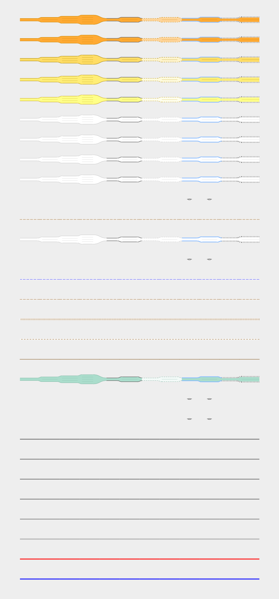

### Trees ###

Visualization of tree leaf types (broadleaved or needle-leaved) and genus or taxon by means of icon shapes and leaf cycles (deciduous or evergreen) by means of color.

#### Example ####

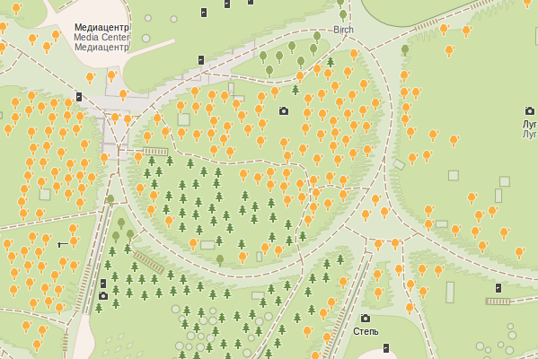

### Viewpoint and camera direction ###

[`direction`](https://wiki.openstreetmap.org/wiki/Key:direction) tag values for [`tourism`](https://wiki.openstreetmap.org/wiki/Key:tourism) = [`viewpoint`](https://wiki.openstreetmap.org/wiki/Tag:tourism=viewpoint) and [`camera:direction`](https://wiki.openstreetmap.org/wiki/Key:camera:direction) for [`man_made`](https://wiki.openstreetmap.org/wiki/Key:man_made) = [`surveillance`](https://wiki.openstreetmap.org/wiki/Tag:man_made=surveillance) are rendered with sectors displaying the direction and angle (15º if angle is not specified) or the whole circle for panorama view. Radial gradient is used for surveillance and inverted radial gradient is used for viewpoints.

#### Example ####

```shell
map-machine render -c 52.50892,13.3244 -s 600,400 -z 18.5
```

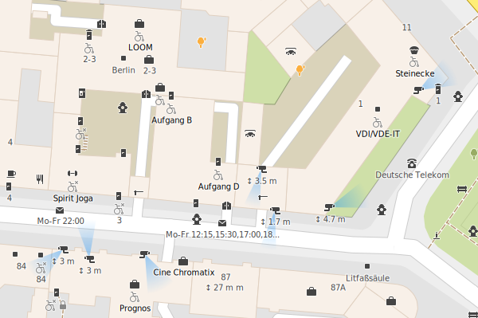

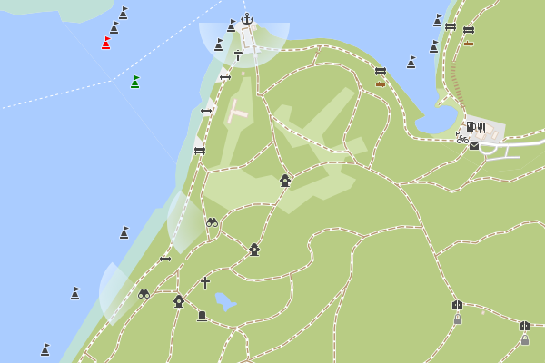

### Power tower design ###

Visualize [`design`](https://wiki.openstreetmap.org/wiki/Key:design) values used with [`power`](https://wiki.openstreetmap.org/wiki/Key:power) = [`tower`](https://wiki.openstreetmap.org/wiki/Tag:power=tower) and [`power`](https://wiki.openstreetmap.org/wiki/Key:power) = [`pole`](https://wiki.openstreetmap.org/wiki/Tag:power=pole) tags. `design` has more than 1 million usages in OpenStreetMap.


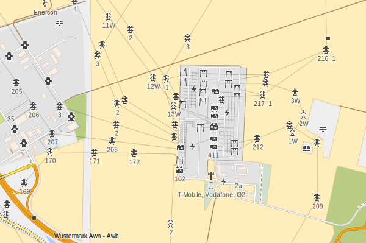

### Colors ###

Map icons have [`colour`](https://wiki.openstreetmap.org/wiki/Key:colour) tag value if it is present, otherwise, icons are displayed with dark grey color by default, purple color for shop nodes, red color for emergency features, and special colors for natural features. Map Machine also takes into account [`building:colour`](https://wiki.openstreetmap.org/wiki/Key:building:colour), [`roof:colour`](https://wiki.openstreetmap.org/wiki/Key:roof:colour) and other `*:colour` tags, and uses the [`colour`](https://wiki.openstreetmap.org/wiki/Key:colour) tag value to paint subway lines.


### Emergency ###


### Japanese map symbols ###

Japanese maps usually use [special symbols](https://en.wikipedia.org/wiki/List_of_Japanese_map_symbols) called *chizukigou* (地図記号) which are different from standard map symbols used in other countries. They can be enabled with `--country jp` option.


### Indoor features ###

Draw indoor features specifying level with `--level` option. Possible values are numbers (e.g. `1`, `0.5`), lists of number separated by `;` (e.g. `1;2;4;4.5`), `all`, `overground`, and `underground`. The default value is not `all`, but `overground`, so underground objects are not shown on the map if `--level` option is not specified.

#### Example ####

```shell
map-machine render -c 4.5978,-74.07507 -s 600,400 -z 19.5 --level 0
```


### Shape combination ###

One of the key features of Map Machine is constructing icons from several shapes.

#### Masts ####

For [`man_made`](https://wiki.openstreetmap.org/wiki/Key:man_made) = [`mast`](https://wiki.openstreetmap.org/wiki/Tag:man_made=mast) distinguish types (communication, lighting, monitoring, and siren) and construction (freestanding or lattice, and using of guys) are rendered by combining 7 unique icon shapes.

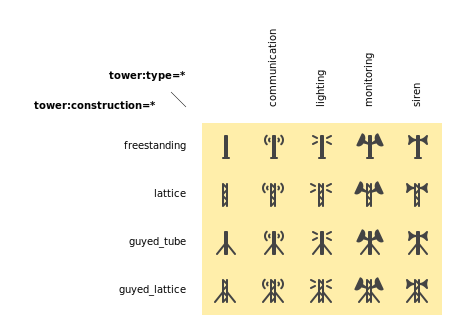

#### Volcanoes ####

For [`natural`](https://wiki.openstreetmap.org/wiki/Key:natural) = [`volcano`](https://wiki.openstreetmap.org/wiki/Tag:natural=volcano) status (active, dormant, extinct, or unspecified) and type (stratovolcano, shield, or scoria) are rendered by combining 7 unique icon shapes.

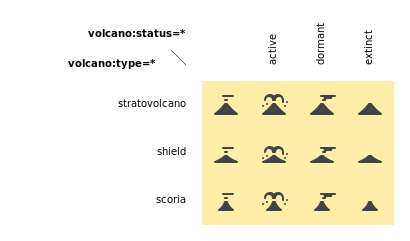

Wireframe view
--------------

### Creation time mode ###

Visualize element creation time with `--mode time`.

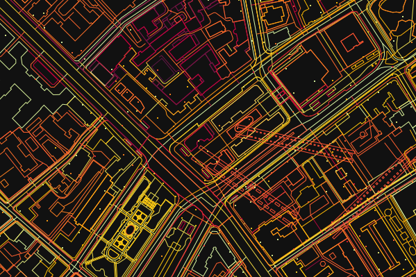

### Author mode ###

Every way and node displayed with the random color picked for each author with `--mode author`.

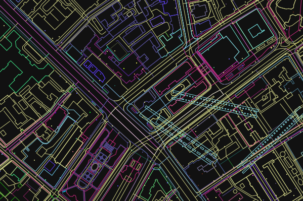

Installation
------------

Requirements: Python 3.9.


  * Install the [cairo 2D graphic library](https://www.cairographics.org/download/),
  * install the [GEOS library](https://libgeos.org),
  * install the Python packages with the command:

```shell
pip install git+https://github.com/enzet/map-machine
```

For more detailed instructions, see [instructions](doc/INSTALL.md).

Map generation
--------------

The `render` command is used to generate an SVG map from OpenStreetMap data. You can run it using:

```shell
map-machine render \
    -b <min longitude>,<min latitude>,<max longitude>,<max latitude> \
    -o <output file name> \
    -z <OSM zoom level> \
    <other arguments>
```

### Example ###

```shell
map-machine render \
    --boundary-box 2.284,48.860,2.290,48.865 \
    --output out/esplanade_du_trocadéro.svg
```

will download OSM data to `cache/2.284,48.860,2.290,48.865.osm` and render an SVG map of the specified area to `out/esplanade_du_trocadéro.svg`.

### Arguments ###

| Option | Description |
|---|---|
| <span style="white-space: nowrap;">`-i`</span>, <span style="white-space: nowrap;">`--input`</span> `<path>` | input XML file name or names (if not specified, file will be downloaded using the OpenStreetMap API) |
| <span style="white-space: nowrap;">`-o`</span>, <span style="white-space: nowrap;">`--output`</span> `<path>` | output SVG file name, default value: `out/map.svg` |
| <span style="white-space: nowrap;">`-b`</span>, <span style="white-space: nowrap;">`--boundary-box`</span> `<lon1>,<lat1>,<lon2>,<lat2>` | geo boundary box |
| <span style="white-space: nowrap;">`--cache`</span> `<path>` | path for temporary OSM files, default value: `cache` |
| <span style="white-space: nowrap;">`-z`</span>, <span style="white-space: nowrap;">`--zoom`</span> `<float>` | OSM zoom level, default value: 18.0 |
| <span style="white-space: nowrap;">`-c`</span>, <span style="white-space: nowrap;">`--coordinates`</span> `<latitude>,<longitude>` | coordinates of any location inside the tile |
| <span style="white-space: nowrap;">`-s`</span>, <span style="white-space: nowrap;">`--size`</span> `<width>,<height>` | resulted image size |

plus [map configuration options](#map-options)

Tile generation
---------------

Command `tile` is used to generate PNG tiles for [slippy maps](https://wiki.openstreetmap.org/wiki/Slippy_Map). To use them, run [Map Machine tile server](#tile-server).

| Option | Description |
|---|---|
| <span style="white-space: nowrap;">`-c`</span>, <span style="white-space: nowrap;">`--coordinates`</span> `<latitude>,<longitude>` | coordinates of any location inside the tile |
| <span style="white-space: nowrap;">`-t`</span>, <span style="white-space: nowrap;">`--tile`</span> `<zoom level>/<x>/<y>` | tile specification |
| <span style="white-space: nowrap;">`--cache`</span> `<path>` | path for temporary OSM files, default value: `cache` |
| <span style="white-space: nowrap;">`-b`</span>, <span style="white-space: nowrap;">`--boundary-box`</span> `<lon1>,<lat1>,<lon2>,<lat2>` | construct the minimum amount of tiles that cover the requested boundary box |
| <span style="white-space: nowrap;">`-z`</span>, <span style="white-space: nowrap;">`--zoom`</span> `<range>` | OSM zoom levels; can be list of numbers or ranges, e.g. `16-18`, `16,17,18`, or `16,18-20`, default value: `18` |
| <span style="white-space: nowrap;">`-i`</span>, <span style="white-space: nowrap;">`--input`</span> `<path>` | input OSM XML file name (if not specified, the file will be downloaded using the OpenStreetMap API) |

plus [map configuration options](#map-options)

### Generate one tile ###

Specify the tile coordinates:

```shell
map-machine tile --tile <OSM zoom level>/<x>/<y>
```

or specify any geographical coordinates inside a tile:

```shell
map-machine tile \
    --coordinates <latitude>,<longitude> \
    --zoom <OSM zoom levels>
```

The tile will be stored as an SVG file `out/tiles/tile_<zoom level>_<x>_<y>.svg` and a PNG file `out/tiles/tile_<zoom level>_<x>_<y>.svg`, where `x` and `y` are tile coordinates. The `--zoom` option will be ignored if it is used with the `--tile` option.

Example:

```shell
map-machine tile -c 55.7510637,37.6270761 -z 18
```

will generate an SVG file `out/tiles/tile_18_158471_81953.svg` and a PNG file `out/tiles/tile_18_158471_81953.png`.

### Generate a set of tiles ###

Specify the boundary box to get the minimal set of tiles that covers the area:

```shell
map-machine tile \
    --boundary-box <min longitude>,<min latitude>,<max longitude>,<max latitude> \
    --zoom <OSM zoom levels>
```

The boundary box will be extended to the boundaries of the minimal tileset that covers the area, then it will be extended a bit more to avoid some artifacts on the edges rounded to 3 digits after the decimal point. The map with the new boundary box coordinates will be written to the cache directory as SVG and PNG files. All tiles will be stored as SVG files `out/tiles/tile_<zoom level>_<x>_<y>.svg` and PNG files `out/tiles/tile_<zoom level>_<x>_<y>.svg`, where `x` and `y` are tile coordinates.

Example:

```shell
map-machine tile -b 2.361,48.871,2.368,48.875
```

will generate 36 PNG tiles at zoom level 18 from tile 18/132791/90164 all the way to 18/132796/90169 and two cached files `cache/2.360,48.869,2.370,48.877_18.svg` and `cache/2.360,48.869,2.370,48.877_18.png`.

Tile server
-----------

The `server` command is used to run a tile server for slippy maps.

```shell
map-machine server
```

Stop server interrupting the process with <kbd>Ctrl</kbd> + <kbd>C</kbd>.

| Option | Description |
|---|---|
| <span style="white-space: nowrap;">`--cache`</span> `<path>` | path for temporary OSM files, default value: `cache` |
| <span style="white-space: nowrap;">`--port`</span> `<integer>` | port number, default value: 8080 |

### Example ###

Create a minimal amount of tiles that cover specified boundary box for zoom levels 16, 17, 18, and 19:

```shell
map-machine tile -b 2.364,48.854,2.367,48.857 -z 16-19
```

Run tile server on 127.0.0.1:8080:

```shell
map-machine server
```

Use JavaScript code for [Leaflet](https://leafletjs.com/):

```javascript
var map = L.map('mapid').setView([48.8555, 2.3655], 18);

L.tileLayer('http://127.0.0.1:8080/tiles/{z}/{x}/{y}', {
    maxZoom: 19,
    attribution: 'Map data &copy; ' +
        '<a href="https://www.openstreetmap.org/copyright">OpenStreetMap</a> ' +
        'contributors, imagery &copy; ' +
        '<a href="https:/github.com/enzet/map-machine">Map Machine</a>',
    id: 'map_machine',
    tileSize: 256,
    zoomOffset: 0
}).addTo(map);
```

HTML code:

```html
<div id="mapid" style="width: 1000px; height: 600px;"></div>
```

Map options
-----------

Map configuration options used by `render` and `tile` commands:

| Option | Description |
|---|---|
| <span style="white-space: nowrap;">`--scheme`</span> `<id> or <path>` | scheme identifier (look for `<id>.yml` file) or path to a YAML scheme file, default value: `default` |
| <span style="white-space: nowrap;">`--buildings`</span> `<mode>` | building drawing mode: no, flat, isometric, isometric-no-parts, default value: `flat` |
| <span style="white-space: nowrap;">`--mode`</span> `<string>` | map drawing mode: normal, author, time, white, black, default value: `normal` |
| <span style="white-space: nowrap;">`--overlap`</span> `<integer>` | how many pixels should be left around icons and text, default value: 12 |
| <span style="white-space: nowrap;">`--labels`</span> `<string>` | label drawing mode: no, main, all, address, default value: `main` |
| <span style="white-space: nowrap;">`--level`</span> | display only this floor level, default value: `overground` |
| <span style="white-space: nowrap;">`--seed`</span> `<string>` | seed for random |
| <span style="white-space: nowrap;">`--tooltips`</span> | add tooltips with tags for icons in SVG files |
| <span style="white-space: nowrap;">`--country`</span> | two-letter code (ISO 3166-1 alpha-2) of country, that should be used for location restrictions, default value: `world` |
| <span style="white-space: nowrap;">`--ignore-level-matching`</span> | draw all map features ignoring the current level |
| <span style="white-space: nowrap;">`--roofs`</span> | draw building roofs, set by default |
| <span style="white-space: nowrap;">`--building-colors`</span> | paint walls (if isometric mode is enabled) and roofs with specified colors |
| <span style="white-space: nowrap;">`--show-overlapped`</span> | show hidden nodes with a dot |

MapCSS 0.2 generation
---------------------

The `mapcss` command can be used to generate a MapCSS scheme. `map-machine mapcss` will create an `out/map_machine_mapcss` directory with simple MapCSS 0.2 scheme adding icons from the Röntgen icon set to nodes and areas: `.mapcss` file and directory with icons.

To create a MapCSS style with Map Machine style also for ways and relations, run `map-machine mapcss --ways`.

| Option | Description |
|---|---|
| <span style="white-space: nowrap;">`--icons`</span> | add icons for nodes and areas, set by default |
| <span style="white-space: nowrap;">`--ways`</span> | add style for ways and relations |
| <span style="white-space: nowrap;">`--lifecycle`</span> | add icons for lifecycle tags; be careful: this will increase the number of node and area selectors by 9 times, set by default |

### Use Röntgen as JOSM map paint style ###


  * Run `map-machine mapcss`.
  * Open [JOSM](https://josm.openstreetmap.de/).
  * Go to <kbd>Preferences</kbd> → Third tab on the left → <kbd>Map Paint Styles</kbd>.
  * Active styles: press <kbd>+</kbd>.
  * URL / File: set path to `out/map_machine_mapcss/map_machine.mapcss`.

To enable/disable the Map Machine map paint style go to <kbd>View</kbd> → <kbd>Map Paint Styles</kbd> → <kbd>Map Machine</kbd>.

#### Example ####

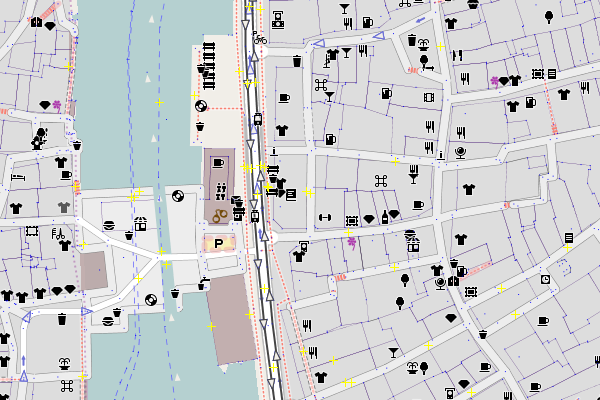

Example of using Röntgen icons on top of the Mapnik style in JOSM. Map Paint Styles look like this:

  * ✓ Mapnik (true)
  * ✓ Map Machine

