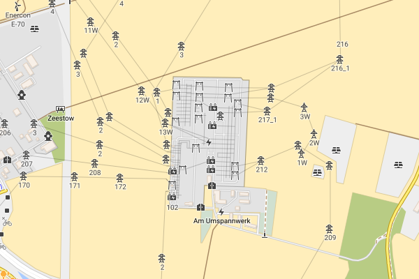

**Röntgen** (or **Roentgen** when ASCII is preferred) project consists of

  * simple Python [OpenStreetMap](http://openstreetmap.org) renderer (see [usage](#usage), [renderer documentation](#map-generation)),
  * [set of CC-BY 4.0 icons](#icon-set) that can be used outside the project.

The idea behind the Röntgen project is to **show all the richness of the OpenStreetMap data**: to have a possibility to *display any map feature* represented by OpenStreetMap data tags by means of colors, shapes, and icons. Röntgen is created for OpenStreetMap contributors: to display all changes one made on the map even if they are small, and for users: to dig down into the map and find every detail that was mapped.

Unlike standard OpenStreetMap layers, **Röntgen is a playground for experiments** where one can easily try to support proposed tags, tags with little or even single usage, deprecated tags.

Röntgen is intended to be highly configurable, so it can generate precise but messy maps for OSM contributors as well as pretty and clean maps for OSM users, can use slow algorithms for some experimental features.

Usage example
-------------

```bash
roentgen render -b 2.284,48.860,2.290,48.865
```

will automatically download OSM data and write output SVG map of the specified area to `out/map.svg`. See [Map generation](#map-generation).

```bash
roentgen tile -b 2.361,48.871,2.368,48.875
```

will automatically download OSM data and write output PNG tiles that cover the specified area to `out/tiles` directory. See [Tile generation](#tile-generation).

Map features
------------

Röntgen features:

  * detailed icons to display subtypes like [power tower design](#power-tower-design),
  * can display multiple icons for one entity to cover more features,
  * use color to visualize [`colour`](https://wiki.openstreetmap.org/wiki/Key:colour) and other features like plant types,
  * display [primitive 3D shapes](#levels) for buildings,
  * display [directions](#direction) with gradient sectors,
  * use width to display roads.

### Isometric building shapes ###

Isometric shapes for walls and shade in proportion to [`building:levels`](https://wiki.openstreetmap.org/wiki/Key:building:levels), [`building:min_level`](https://wiki.openstreetmap.org/wiki/Key:building:min_level), [`height`](https://wiki.openstreetmap.org/wiki/Key:height) and [`min_height`](https://wiki.openstreetmap.org/wiki/Key:min_height) values.


### Trees ###

Visualization of tree leaf types (broadleaved or needleleaved) and genus or taxon by means of icon shapes and leaf cycles (deciduous or evergreen) by means of color.


### Viewpoint and camera direction ###

Visualize [`direction`](https://wiki.openstreetmap.org/wiki/Key:direction) tag for [`tourism`](https://wiki.openstreetmap.org/wiki/Key:tourism)=[`viewpoint`](https://wiki.openstreetmap.org/wiki/Tag:tourism=viewpoint) and [`camera:direction`](https://wiki.openstreetmap.org/wiki/Key:camera:direction) for [`man_made`](https://wiki.openstreetmap.org/wiki/Key:man_made)=[`surveillance`](https://wiki.openstreetmap.org/wiki/Tag:man_made=surveillance).


### Power tower design ###

Visualize [`design`](https://wiki.openstreetmap.org/wiki/Key:design) values used with [`power`](https://wiki.openstreetmap.org/wiki/Key:power)=[`tower`](https://wiki.openstreetmap.org/wiki/Tag:power=tower) tag.




### Emergency ###


### Japanese map symbols ###

There are [special symbols](https://en.wikipedia.org/wiki/List_of_Japanese_map_symbols) appearing on Japanese maps.


Icon set
--------

The central feature of the project is Röntgen icon set. It is a set of monochrome 14 × 14 px pixel-aligned icons. Unlike the Röntgen source code, which is under MIT license, all icons are under [CC BY](http://creativecommons.org/licenses/by/4.0/) license. So, with the appropriate credit icon set can be used outside the project. Some icons can be used as emoji symbols.

All icons tend to support common design style, which is heavily inspired by [Maki](https://github.com/mapbox/maki), [Osmic](https://github.com/gmgeo/osmic), and [Temaki](https://github.com/ideditor/temaki).

Icons are used to visualize tags for nodes and areas. Unlike other renderers, Röntgen can use more than one icon to visualize an entity and use colors to visualize [`colour`](https://wiki.openstreetmap.org/wiki/Key:colour) value or other entity properties (like material or genus).


Feel free to request new icons via issues for whatever you want to see on the map. No matter how frequently the tag is used in OpenStreetMap since final goal is to cover all tags. However, common used tags have priority, other things being equal.

Generate icon grid and sets of individual icons with `python roentgen.py icons`. It will create `out/icon_grid.svg` file, and SVG files in `out/icons_by_id` directory where files are named using shape identifiers (e.g. `power_tower_portal_2_level.svg`) and in `icons_by_name` directory where files are named using shape names (e.g. `Röntgen portal two-level transmission tower.svg`). Files from the last directory are used in OpenStreetMap wiki (e.g. [`File:Röntgen_portal_two-level_transmission_tower.svg`](https://wiki.openstreetmap.org/wiki/File:R%C3%B6ntgen_portal_two-level_transmission_tower.svg)).

### Shape combination ###

Röntgen constructs icons from the shapes extracted from the sketch SVG file. Some icons consists of just one shape, to construct other it may be necessary to combine two or more shapes.


Wireframe view
--------------

### Creation time mode ###

Visualize element creation time with `--mode time`.


### Author mode ###

Every way and node displayed with the random color picked for each author with `--mode user-coloring`.


Installation
------------

Requirements: Python 3.9.

To install all packages, run:

```bash
pip install -r requirements.txt
pip install .
```

Map generation
--------------

Command `render` is used to generates SVG map from OpenStreetMap data. You can run it using:

```bash
roentgen render \
    -b <min longitude>,<min latitude>,<max longitude>,<max latitude> \
    -o <output file name> \
    -s <osm zoom level> \
    <other arguments>
```

### Example ###

```bash
roentgen render \
    --boundary-box 2.284,48.860,2.290,48.865 \
    --output out/esplanade_du_trocadéro.svg
```

will download OSM data to `cache/2.284,48.860,2.290,48.865.osm` and write output SVG map of the specified area to `out/esplanade_du_trocadéro.svg`.

### Arguments ###

| Option | Description |
|---|---|
| <span style="white-space: nowrap;">`-i`</span>, <span style="white-space: nowrap;">`--input`</span> `<path>` | input XML file name or names (if not specified, file will be downloaded using OpenStreetMap API) |
| <span style="white-space: nowrap;">`-o`</span>, <span style="white-space: nowrap;">`--output`</span> `<path>` | output SVG file name, default value: `out/map.svg` |
| <span style="white-space: nowrap;">`-b`</span>, <span style="white-space: nowrap;">`--boundary-box`</span> `<lon1>,<lat1>,<lon2>,<lat2>` | geo boundary box; if first value is negative, enclose the value with quotes and use space before `-` |
| <span style="white-space: nowrap;">`-s`</span>, <span style="white-space: nowrap;">`--scale`</span> `<float>` | OSM zoom level (may not be integer), default value: 18 |
| <span style="white-space: nowrap;">`--cache`</span> `<path>` | path for temporary OSM files, default value: `cache` |
| <span style="white-space: nowrap;">`--labels`</span> | label drawing mode: `no`, `main`, or `all`, default value: `main` |
| <span style="white-space: nowrap;">`--overlap`</span> | how many pixels should be left around icons and text, default value: 12 |
| <span style="white-space: nowrap;">`--mode`</span> | map drawing mode, default value: `normal` |
| <span style="white-space: nowrap;">`--seed`</span> | seed for random |
| <span style="white-space: nowrap;">`--level`</span> | display only this floor level |

Tile generation
---------------

Command `tile` is used to generate PNG tiles for [slippy maps](https://wiki.openstreetmap.org/wiki/Slippy_Map). To use them, run [Röntgen tile server](#tile-server).

| Option | Description |
|---|---|
| <span style="white-space: nowrap;">`-c`</span>, <span style="white-space: nowrap;">`--coordinates`</span> `<latitude>,<longitude>` | coordinates of any location inside the tile |
| <span style="white-space: nowrap;">`-s`</span>, <span style="white-space: nowrap;">`--scale`</span> `<integer>` | OSM zoom level, default value: 18 |
| <span style="white-space: nowrap;">`-t`</span>, <span style="white-space: nowrap;">`--tile`</span> `<scale>/<x>/<y>` | tile specification |
| <span style="white-space: nowrap;">`--cache`</span> `<path>` | path for temporary OSM files, default value: `cache` |
| <span style="white-space: nowrap;">`-b`</span>, <span style="white-space: nowrap;">`--boundary-box`</span> `<lon1>,<lat1>,<lon2>,<lat2>` | construct the minimum amount of tiles that cover requested boundary box |

### Generate one tile ###

Specify tile coordinates:

```bash
roentgen tile --tile <OSM zoom level>/<x>/<y>
```

or specify any geographical coordinates inside a tile:

```bash
roentgen tile \
    --coordinates <latitude>,<longitude> \
    --scale <OSM zoom level>
```

Tile will be stored as SVG file `out/tiles/tile_<zoom level>_<x>_<y>.svg` and PNG file `out/tiles/tile_<zoom level>_<x>_<y>.svg`, where `x` and `y` are tile coordinates. `--scale` option will be ignored if it is used with `--tile` option.

Example:

```bash
roentgen tile -c 55.7510637,37.6270761 -s 18
```

will generate SVG file `out/tiles/tile_18_158471_81953.svg` and PNG file `out/tiles/tile_18_158471_81953.png`.

### Generate a set of tiles ###

Specify boundary box to get the minimal set of tiles that covers the area:

```bash
roentgen tile \
    --boundary-box <min longitude>,<min latitude>,<max longitude>,<max latitude> \
    --scale <OSM zoom level>
```

Boundary box will be extended to the boundaries of the minimal tile set that covers the area, then it will be extended a bit more to avoid some artifacts on the edges rounded to 3 digits after the decimal point. Map with new boundary box coordinates will be written to the cache directory as SVG and PNG files. All tiles will be stored as SVG files `out/tiles/tile_<zoom level>_<x>_<y>.svg` and PNG files `out/tiles/tile_<zoom level>_<x>_<y>.svg`, where `x` and `y` are tile coordinates.

Example:

```bash
roentgen tile -b 2.361,48.871,2.368,48.875
```

will generate 36 PNG tiles at scale 18 from tile 18/132791/90164 all the way to 18/132796/90169 and two cached files `cache/2.360,48.869,2.370,48.877.svg` and `cache/2.360,48.869,2.370,48.877.png`.

Tile server
-----------

Command `server` is used to run tile server for slippy maps.

```
roentgen server
```

Stop server interrupting process with <kbd>Ctrl</kbd> + <kbd>C</kbd>.

MapCSS 0.2 generation
---------------------

Command `mapcss` is used to generate MapCSS scheme. `roentgen mapcss` will create `out/roentgen_mapcss` directory with simple MapCSS 0.2 scheme adding icons from Röntgen icon set to nodes and areas: `.mapcss` file and directory with icons.

To create MapCSS with only Röntgen icons run `roentgen mapcss --no-ways`.

| Option | Description |
|---|---|
| <span style="white-space: nowrap;">`--icons`</span> | add icons for nodes and areas, set by default |
| <span style="white-space: nowrap;">`--ways`</span> | add style for ways and relations, set by default |
| <span style="white-space: nowrap;">`--lifecycle`</span> | add icons for lifecycle tags; be careful: this will increase the number of node and area selectors by 9 times, set by default |

### Use Röntgen as JOSM map paint style ###

  * Run `roentgen mapcss`.
  * Open [JOSM](https://josm.openstreetmap.de/).
  * Go to <kbd>Preferences</kbd> → Third tab on the left → <kbd>Map Paint Styles</kbd>.
  * Active styles: press <kbd>+</kbd>.
  * URL / File: set path to `out/roentgen_mapcss/roentgen.mapcss`.

To enable / disable Röntgen map paint style go to <kbd>View</kbd> → <kbd>Map Paint Styles</kbd> → <kbd>Röntgen</kbd>.

