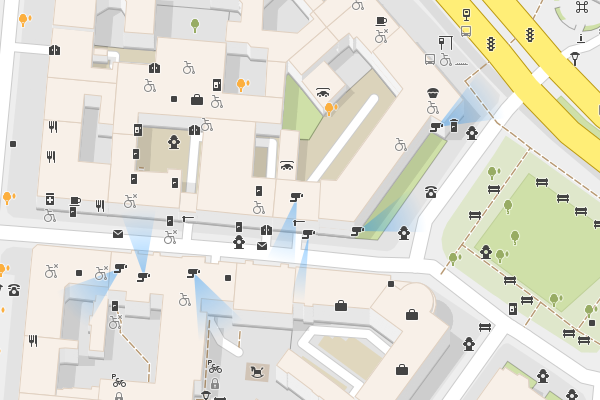
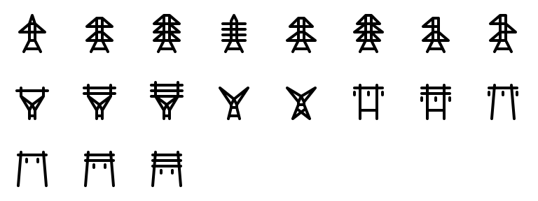

**Röntgen** is a

  * simple Python [OpenStreetMap](http://openstreetmap.org) renderer,
  * set of icons,
  * and map styles.

[](https://travis-ci.org/enzet/Roentgen)

The idea behind Röntgen project is to have a possibility to *display any map feature* represented by OpenStreetMap data tags by means of colors, shapes, and icons.

Röntgen is primarily created for OpenStreetMap contributors. Suppose, you spent time adding colors for building walls, benches and shelters for bus stops but they are not represented on the standard tile layer. Röntgen helps to display all changes you made.

Nevertheless, Röntgen map generator can generate precise but messy maps for OSM contributors as well as pretty and clean maps for OSM users.

Map features
------------

### Building levels ###

Simple shapes for walls and shade in proportion to `[building:levels](https://wiki.openstreetmap.org/wiki/Key:building:levels)` value.


### Trees ###

Tree leaf types, leaf cycles, and genes.


### Viewpoint and camera direction ###

Visualize `[direction](https://wiki.openstreetmap.org/wiki/Key:direction)` tag for `[tourism](https://wiki.openstreetmap.org/wiki/Key:tourism)=[viewpoint](https://wiki.openstreetmap.org/wiki/Tag:tourism=viewpoint)` and `[camera:direction](https://wiki.openstreetmap.org/wiki/Key:camera:direction)` for `[man_made](https://wiki.openstreetmap.org/wiki/Key:man_made)=[surveillance](https://wiki.openstreetmap.org/wiki/Tag:man_made=surveillance)`.



### Power tower design ###

Visualize `[design](https://wiki.openstreetmap.org/wiki/Key:design)` values used with `[power](https://wiki.openstreetmap.org/wiki/Key:power)=[tower](https://wiki.openstreetmap.org/wiki/Tag:power=tower)` tag.



### Emergency ###


Icon set
--------

If tag is drawable it is displayed using icon combination and colors. All icons are under [CC BY](http://creativecommons.org/licenses/by/4.0/) license. So, do whatever you want but give appropriate credit. Icon set is heavily inspired by [Maki](https://github.com/mapbox/maki), [Osmic](https://github.com/gmgeo/osmic), and [Temaki](https://github.com/ideditor/temaki) icon sets.


Feel free to request new icons via issues for whatever you want to see on the map. No matter how frequently the tag is used in OpenStreetMap since final goal is to cover all tags. However, common used tags have priority, other things being equal.

Draw icon grid: `python run.py grid`.

### Icon combination ###

Some icons can be combined into new icons.


Röntgen map styles
------------------

### All tags style ###

Options: `--show-missing-tags --overlap 0`.

Display as many OpenStreetMap data tags on the map as possible.

### Pretty style ###

Options: `--draw-captions main --level overground`.

Display only not overlapping icons and main captions.

### Creation time mode ###

Visualize element creation time with `--mode time`.


### Author mode ###

Every way and node displayed with the random color picked for each author with `--mode user-coloring`.


Map generation
--------------

**Requirements**: Python (at least 3.8) and Python libraries (install everything using `pip install -r requirements.txt`).

There are simple Python renderer that generates SVG map from OpenStreetMap data. You can run it using:

```bash
python run.py \
    -b ${LONGITUDE_1},${LATITUDE_1},${LONGITUDE_2},${LATITUDE_2} \
    -o ${OUTPUT_FILE_NAME} \
    -s ${OSM_ZOOM_LEVEL}
```

Example:

```bash
python run.py -b 2.284,48.86,2.29,48.865
```

### Main arguments ###

#### Required ####

  * `--boundary-box` or `-b`: boundary box to draw. Value: `<longitude 1>,<latitude 1>,<longitude 2>,<latitude 2>`. Use space before first `-` to escape negative values.

#### Optional ####

  * `--scale` or `-s`: OSM [zoom level](https://wiki.openstreetmap.org/wiki/Zoom_levels). Default is 18.
  * `-o`: path to output SVG file name. Default is `map.svg`.
  * `-i`: path to input XML file name. If this argument is not set, XML file will be downloaded through OpenStreetMap API.

Check all arguments with `python run.py --help`.

