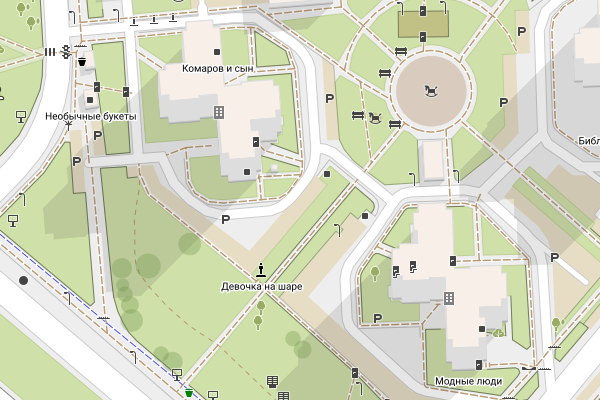
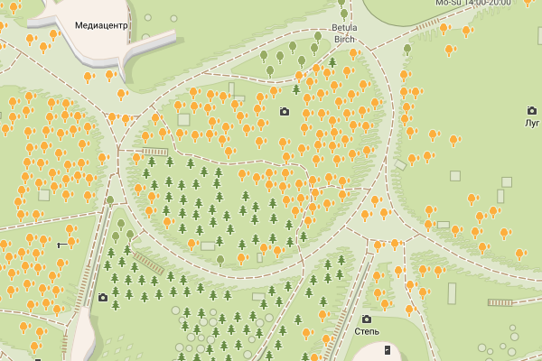
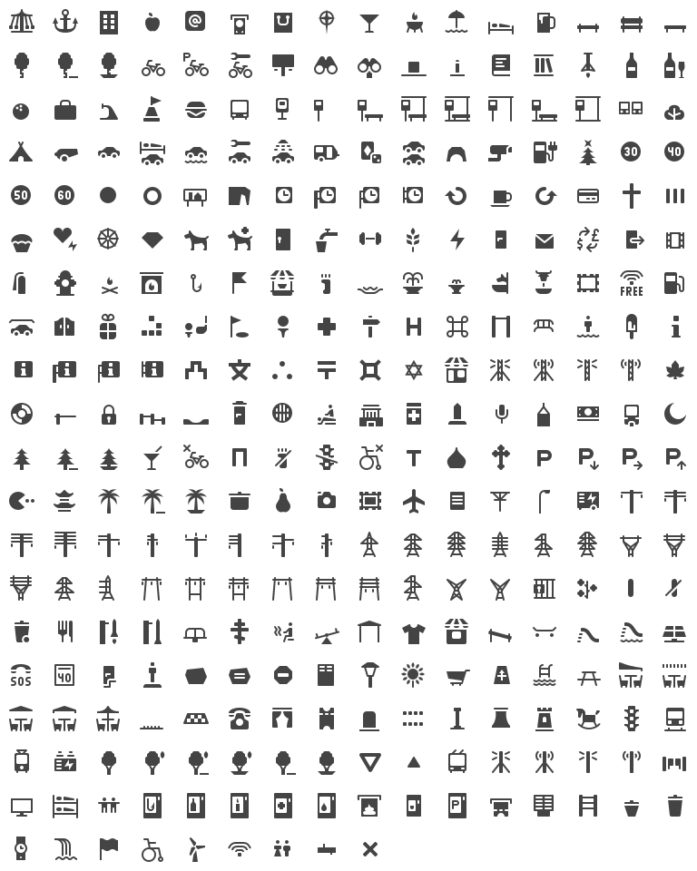
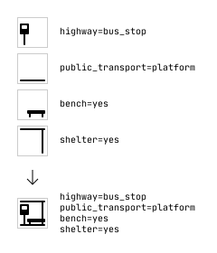
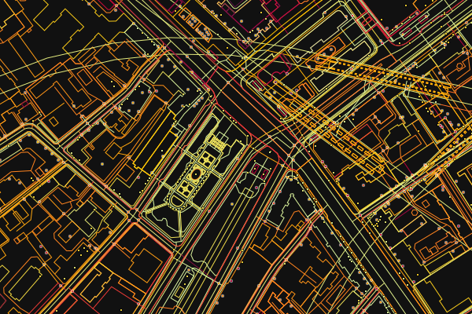
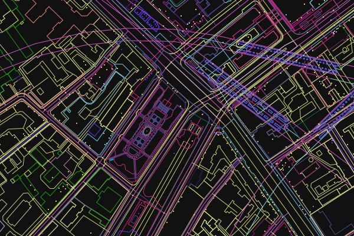

**Röntgen** is a 
  * simple Python [OpenStreetMap](http://openstreetmap.org) renderer,
  * set of icons,
  * and map styles.

The idea behind Röntgen project is to have a possibility to display every
OpenStreetMap data tag on the map. Suppose, you spent time adding colors for
building walls, benches and shelters for bus stops but they do not represented
on the map. Röntgen helps to display all changes you made.

Nevertheless, Röntgen map generator can generate precise but messy maps for OSM
contributors as well as pretty and clean maps for OSM users.

Map elements
------------

### 3D buildings ###

Simple shapes for walls, shade, and roof.



### Trees ###

Tree leaf types, leaf cycles, and genes.



Icon set
--------

If tag is drawable it is displayed using icon combination and colors. All icons
are under [CC BY 4.0](http://creativecommons.org/licenses/by/4.0/) license. So,
do whatever you want but give appropriate credit. Icon set is heavily inspired
by [Osmic](https://github.com/gmgeo/osmic) icon set.



Feel free to request new icons via issues for whatever you want to see on the
map. No matter how frequently the tag is used in OpenStreetMap since final goal
is to cover all tags. However, common used tags have priority, other things
being equal.

### Icon combination ###

Some icons can be combined into new icons.




Röntgen map styles
------------------

### All tags style ###

Options: `--show-missing-tags --overlap 0`.

Display as many OpenStreetMap data tags on the map as possible.

### Pretty style ###

Options: `--draw-captions main --level overground`.

Display only not overlapping icons and main captions.

### Creation time mode ###

Visualize element creation time.



### Author mode ###

Visualize element authors.



Map generation
--------------

**Requirements**: Python 3.7.

There are simple Python renderer that generates SVG map from OpenStreetMap data.
You can run it using:

```bash
python3 run.py \
    -b ${LONGITUDE_1},${LATITUDE_1},${LONGITUDE_2},${LATITUDE_2} \
    -o ${OUTPUT_FILE_NAME} \
    -s ${WIDTH},${HEIGHT}
```

Example:

```bash
python3 run.py -b 2.284,48.86,2.29,48.865 -o map.svg -s 1000,1000
```

### Main arguments ###

#### Required ####

<table>
    <tr><td>Option</td><td>Value</td><td>Description</td></tr>
    <tr>
        <td><tt>-b</tt>, <tt>--boundary-box</tt></td>
        <td>
            <tt>&lt;longitude 1&gt;,&lt;latitude 1&gt;,&lt;longitude 
            2&gt;,&lt;latitude 2&gt;</tt>
        </td>
        <td>Boundary box to draw.</td>
    </tr>
    <tr>
        <td><tt>-s</tt>, <tt>--size</tt></td>
        <td><tt>&lt;width&gt;,&lt;height&gt;</tt></td>
        <td>Result image size in pixels.</td>
    </tr>
    <tr>
        <td><tt>-o</tt></td>
        <td><tt>&lt;path&gt;</tt></td>
        <td>Path to output SVG file name.</td>
    </tr>
</table>

#### Optional ####

<table>
    <tr><td>Option</td><td>Value</td><td>Description</td></tr>
    <tr>
        <td><tt>-i</tt></td>
        <td><tt>&lt;path&gt;</tt></td>
        <td>Path to input XML file name. If this argument is not set, XML file
        will be downloaded through OpenStreetMap API.</td>
    </tr>
</table>

Check all arguments with `python3 run.py --help`.
